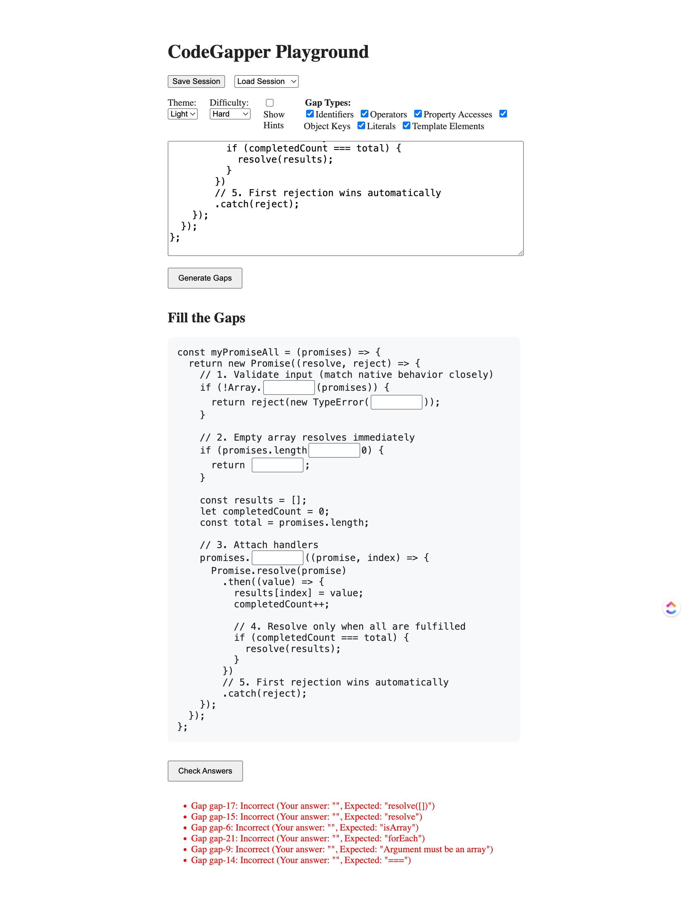
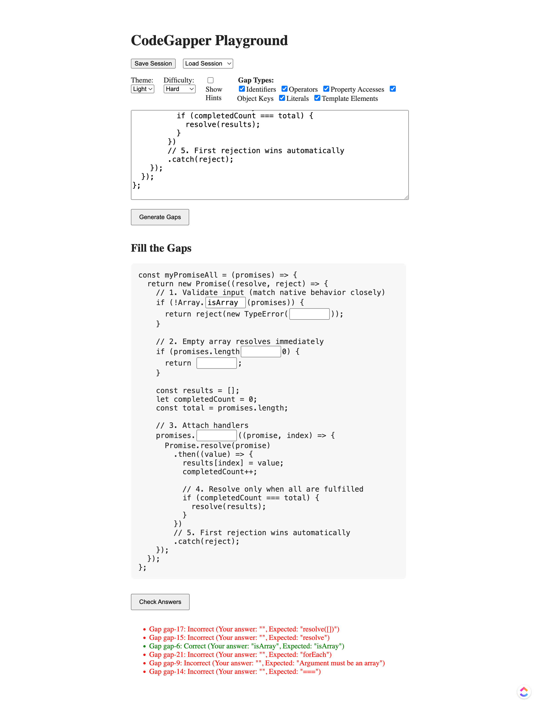

# CodeGapper Playground 🎯

> An interactive JavaScript learning tool that generates fill-in-the-blanks exercises from your code using AST parsing.



## ✨ Features

- **🧠 Intelligent Gap Generation**: Uses AST parsing to create meaningful gaps in JavaScript code
- **🎚️ Multiple Difficulty Levels**: Easy, Medium, and Hard modes with adaptive complexity
- **🔍 Gap Type Filtering**: Practice specific concepts (identifiers, operators, literals, etc.)
- **✅ Answer Validation**: Real-time feedback with detailed results
- **💾 Session Management**: Save and load your exercises
- **🌓 Theme Support**: Light and dark themes
- **🎲 Smart Randomization**: Diversity-aware gap selection with history tracking
- **📊 Type-Based Tracking**: Avoids repetitive type patterns



## 🚀 Quick Start

### Prerequisites

- Node.js 18+ 
- npm or yarn

### Installation

```bash
# Clone the repository
git clone https://github.com/your-org/js-fill-blanks-exercises.git

# Navigate to project directory
cd js-fill-blanks-exercises

# Install dependencies
npm install

# Start development server
npm run dev
```

The application will be available at `http://localhost:5173`

### Build for Production

```bash
npm run build
npm run preview
```

## 📖 Usage

1. **Enter Code**: Paste or type JavaScript code in the editor
2. **Configure Settings**: 
   - Select difficulty level (Easy/Medium/Hard)
   - Choose gap types to practice
   - Adjust theme preferences
3. **Generate Gaps**: Click "Generate Gaps" to create fill-in-the-blanks
4. **Fill the Blanks**: Type your answers in the generated gaps
5. **Check Answers**: Click "Check Answers" to see results
6. **Save Session**: Save your progress for later

## 🏗️ Architecture

### Core Components

- **Gap Engine** (`src/features/gapEngine/`): AST parsing and gap generation
- **Editor** (`src/features/editor/`): Interactive gap editing interface
- **Result Panel** (`src/features/resultPanel/`): Answer validation and feedback
- **State Management**: Zustand stores for app state

### Technology Stack

- **React 19** - UI framework
- **TypeScript** - Type safety
- **Vite** - Build tool and dev server
- **Acorn** - JavaScript parser
- **Zustand** - State management
- **Prism.js** - Syntax highlighting

## 🎯 Gap Types

The application supports 6 main gap type categories:

1. **Identifiers** - Variable names, function names
2. **Operators** - Assignment, binary, unary, logical operators
3. **Property Access** - Object properties, method calls
4. **Object Keys** - Object property keys
5. **Literals** - String, number, boolean values
6. **Template Elements** - Template literals, expressions

Each category maps to multiple internal AST node types for precise control.

## 🔧 Configuration

### Difficulty Levels

- **Easy**: 2 gaps, identifiers and literals only
- **Medium**: 4 gaps, adds object keys
- **Hard**: 6 gaps, all gap types available

### Gap Type Mapping

Customize gap type mappings in `src/features/gapEngine/lib/gapTypeMapping.ts`:

```typescript
export const GAP_TYPE_MAPPING: Record<string, GapTypeMapping> = {
  identifier: {
    uiType: 'identifier',
    mappedTypes: ['identifier'],
    description: 'Variable and function names'
  },
  // ... more types
};
```

## 📊 Project Status

### ✅ Completed

- Core gap generation engine
- Multiple gap types support
- Difficulty-based filtering
- Answer validation
- Session persistence
- Theme support
- Per-code history tracking
- Type-based history tracking
- Diversity-aware selection

### 🚧 In Progress

- Type safety improvements
- Enhanced error handling
- Performance optimizations

### 📅 Planned

See [ROADMAP.md](./ROADMAP.md) for detailed roadmap.

## 🧪 Development

### Available Scripts

```bash
npm run dev      # Start development server
npm run build    # Build for production
npm run preview  # Preview production build
npm run lint     # Run ESLint
```

### Project Structure

```
src/
├── app/                 # Main application
├── features/            # Feature modules
│   ├── codeInput/      # Code input handling
│   ├── gapEngine/      # Gap generation logic
│   ├── editor/         # Gap editor UI
│   ├── resultPanel/    # Results display
│   ├── savedSessions/  # Session management
│   └── uiSettings/     # UI preferences
└── assets/             # Static assets
```

## 🤝 Contributing

Contributions are welcome! Please see [ROADMAP.md](./ROADMAP.md) for areas where help is needed.

1. Fork the repository
2. Create your feature branch (`git checkout -b feature/amazing-feature`)
3. Commit your changes (`git commit -m 'Add amazing feature'`)
4. Push to the branch (`git push origin feature/amazing-feature`)
5. Open a Pull Request

## 📝 License

[Add your license here]

## 🙏 Acknowledgments

- [Acorn](https://github.com/acornjs/acorn) - JavaScript parser
- [Prism.js](https://prismjs.com/) - Syntax highlighting
- [Zustand](https://github.com/pmndrs/zustand) - State management

## 📞 Support

- **Issues**: [GitHub Issues](https://github.com/your-org/js-fill-blanks-exercises/issues)
- **Discussions**: [GitHub Discussions](https://github.com/your-org/js-fill-blanks-exercises/discussions)

---

**Made with ❤️ for JavaScript learners**
