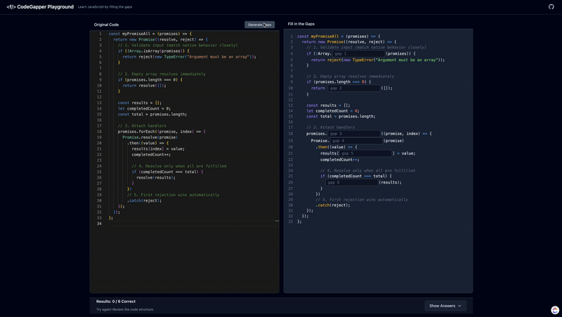

# CodeGapper Playground — Roadmap

## Vision

Interactive web app for learning JavaScript via fill-in-the-blanks. Uses AST parsing (Acorn) to generate gaps; supports difficulty levels, session save/load, and answer validation.

- **Stack**: React 19, TypeScript, Vite, Zustand, Prism.js

---

## Demo

---

## Current Status

- **Done**: Core gap engine, multiple gap types, difficulty levels, session persistence, theme support, diversity-aware selection, deduplication
- **In progress**: Type safety (replace `any`), error handling, performance
- **Planned**: Auth, progress tracking, exercise library, export/import, mobile responsiveness

---

## Phases

### Phase 1 — Foundation ✅

- AST-based gap generation, type support, answer validation
- Session persistence, themes, difficulty levels

### Phase 2 — UX & Quality 🚧

- Type safety (Acorn types, typed errors)
- Better error messages, loading states, keyboard shortcuts
- Undo/redo, copy/paste for answers

### Phase 3 — Learning & Content 📅

- Progress tracking and basic stats
- Exercise library (categorized, searchable)
- Validation improvements (partial credit, hints, multiple correct answers)
- Export/import (JSON, share, PDF/CSV)

### Phase 4 — Scale & Polish

- Performance (code splitting, memoization, Web Workers)
- Mobile: responsive UI, touch, PWA, offline
- Auth and collaboration (sharing, ratings, team mode)
- Analytics (recommendations, adaptive difficulty)

---

## Technical Debt

- Replace `any` with proper Acorn/typed interfaces
- Centralized error handling and edge-case coverage in gap generation
- Extract gap visitors and shared logic into clear modules
- Tests: unit (gap engine), integration (flows), E2E (critical paths)
- Docs: API/JSDoc, user guide
- Accessibility: ARIA, keyboard nav, screen readers

---

## Future Ideas (Backlog)

Features to consider in future iterations:

- **Hint support** — In-exercise hints for gaps (e.g. first letter, type, or contextual clue)
- **Import/export** — Export/import sessions or exercises (e.g. JSON, share links, PDF/CSV)
- **Advanced filters** — Filter/sort by order, ascending/descending, gap type, difficulty, etc.
- **AI code explanation mode** — Optional AI-generated explanations for code or gaps (e.g. why a gap is there, what the snippet does)

Other ideas: i18n, advanced analytics, learning-path recommendations. Details and tasks can live in GitHub issues; this file stays high-level.

---

*Last updated: 2024*
